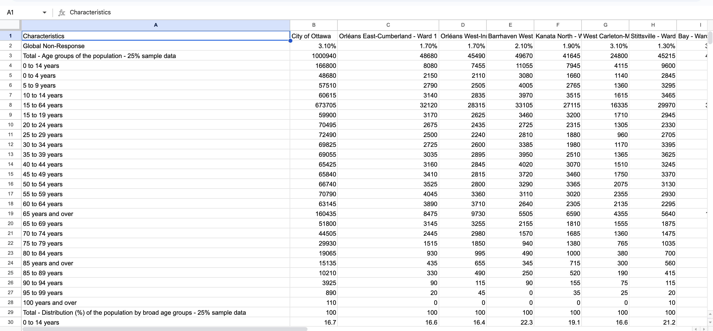
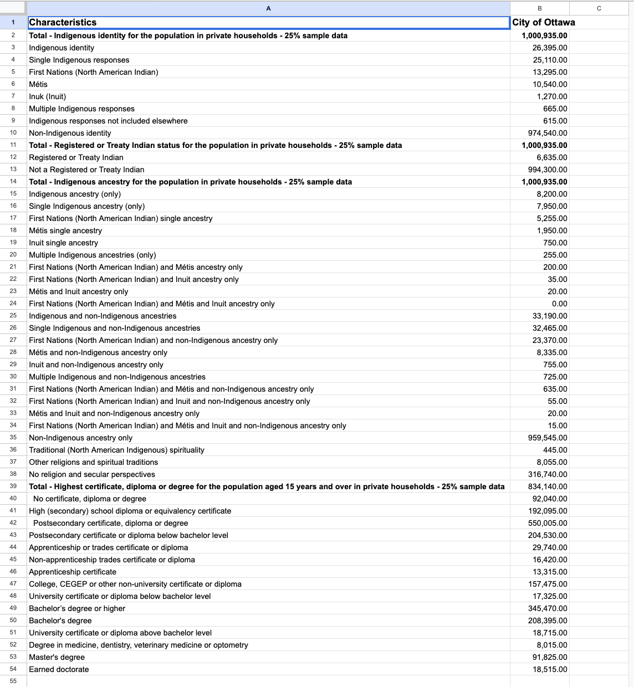

**November 10th 2025** 
**MPAD 2003-A** 
**Gilven Senires, Annabel Young and Kiana Emile** 
**Presented to Jean-Sébastien Marier** 

# Exploratory Data Analysis (EDA) & Pitch

## 1. Introduction

For this assignment, we will be analyzing a City of Ottawa dataset to explore the question: *How many people of the Indigenous groups graduate with a university degree or diploma (post-secondary education) in the city of Ottawa?* The dataset, titled “2021 Long Form Census - Ward Data” was collected through the 2021 Census and published on the [Open Ottawa](https://open.ottawa.ca/datasets/ottawa::2021-long-form-census-ward-data/explore) platform. In our context, it includes demographic information about Ottawa’s population, such as Indigenous identity, status, ancestry, and various education levels. The information was gathered by Statistics Canada and is organized into categories that show both total population counts and educational levels. The dataset can be accessed on Open Ottawa and the CSV version is available on this [GitHub portal](https://github.com/jsmarier-courses/exploratory-data-analysis-and-pitch-mpad2003-f25-group-4). This project is divided into five main sections. It starts with the “Getting Data” section, which explains how the dataset was sourced and imported. The next major section, Understanding Data, includes three subsections, “VIMO Analysis, Cleaning, and Exploratory Data Analysis (EDA).” In these subsections, we review the dataset’s validity by identifying any missing, invalid, or outlier values and assessing its overall accuracy. To make the data easier to interpret, we will clean the spreadsheet and create both a pivot table and a chart to provide a clearer visual overview. Following that, the “Potential Story” section uses the cleaned data to propose a potential story that connects the data to actuality. Finally, the “Conclusion” summarizes the overall experience, reflecting on strengths, challenges, and what could have been improved during the process. The project ends with a “References” section formatted according to APA guidelines.

## 2. Getting Data

To import the data into Google Sheets, we used the link provided in the Dataset category titled “2021 Long Form Census – Ward Data.” The link redirected us to the City of Ottawa’s dataset page, where the origin and reliability of the data are briefly explained. The census data came from both short and long questionnaires; the short one was sent to every household for a general overview, and the long one was sent to 25% of households for more detailed information. Yet, for this project, we worked specifically with the Long Form Census, which the City of Ottawa made available as a downloadable table. Instead of downloading the CSV file, we imported the dataset directly into Google Sheets. To do this, we right-clicked the dataset link, selected “Copy link address,” and in a new spreadsheet, we used the formula: `IMPORTDATA`. This automatically imported the complete dataset from the Long Form Census. Finally, to make the data editable, we converted the imported information into plain values. Since we couldn’t remember the keyboard shortcut, in the Google Sheets we clicked on Edit then Paste special, then Values only. This allowed us to create a fully customizable spreadsheet based on the data provided by the City of Ottawa.

With 26 columns and 2,603 rows, our first impression of the dataset was that it looked overwhelming. At first glance, we felt confused and unsure where to even start. The data appeared unclean and disorganized, making it difficult to sort through the endless rows and columns. Many of the row descriptions were duplicates, which made it harder to tell sections apart and understand what each value referred to. The most confusing part was Column A, labeled “Characteristics.” Its sections were formatted inconsistently, each containing different variable types that seemed scattered with no clear structure. Overall, the dataset wasn’t visually appealing and was quite unclear to navigate at first. 

*Figure 1: The "Dataset" prompt on Google Sheets just after importation.*

**Public Link to Google Sheets Spreadsheet:**
* [2021 Long Form Census - Ward Data](https://docs.google.com/spreadsheets/d/16wwc8f8S7XUzIEwFFINbTcRVEzD9WPAFdmFGat0rJ5g/edit?usp=sharing)

To simplify things, we decided to keep only Columns A and B, focusing on two main sections: Indigenous identity types and education levels. In terms of variables, Column A, titled “Characteristics,” includes nominal variables because it lists categories instead of numbers. Such as Indigenous identity, Métis, etc, or the Highest certificate, diploma, or degree. According to Statistics: Power from Data! in the “Types of Variables” section under nominal variables, these labels are used “to name and organize the data, but there’s no particular order between them.” Whereas Column B, which lists “City of Ottawa,” contains discrete numerical variables. From the same site under discrete variables, however, these are countable numbers that represent population totals within each category, for instance, 26,395 Indigenous identity, which are fixed counts of people. Moreover, within the education section, the dataset also involves ordinal variables, like “No certificate, diploma, or degree,” “High school diploma,” “Bachelor’s degree,” etc.  These are ordered categories because each represents a different level of educational accomplishment, ranking from lower to higher qualifications. What we found that was missing is that while Ottawa shows a highly educated population overall, with more than ​550,005 people having postsecondary education the data doesn’t reveal how education levels differ across groups. For example, whether Indigenous populations have the same access to higher education. Including this context could have been a potential story about educational access and equity in Ottawa.

## 3. Understanding Data

### 3.1. VIMO Analysis

To check the quality and accuracy of the dataset, a VIMO analysis was conducted, which verifies whether data values are Valid, Invalid, Missing, and Outliers.

**Valid:**

Most of the dataset appears valid and consistent. According to Statistics Canada, in the video *Data Accuracy and Validation: Methods to Ensure the Quality of Data* (timestamp 1:14), “valid data is complete, within a reasonable range, and reflects reality.” For instance, the total population of 1,000,935 is the same across all main categories, Indigenous identity, status, and ancestry, showing that the data was gathered from the same singular source. Another example is the “Single Indigenous responses” category, which counts 25,110 people total. Adding the subcategories First Nations (13,295), Métis (10,540), and Inuit (1,270) gives 25,105; there’s a small difference of 5. According to *Statistics Canada’s Indigenous People Technical Report* under the *Data Quality Assessment* section, this small gap  is likely due to “the rounding process, which transforms all raw counts into randomly rounded counts, reducing the possibility of individuals being identified.” Overall, this form of confidentiality measure is normal in census data and doesn’t affect its validity. Looking at education, the subcategories also make sense. For example, 29,740 people hold postsecondary apprenticeship or trades certificates, 157,475 have college/CEGEP/non-university certificates, and 345,470 have a bachelor’s degree or higher. These numbers logically fit within the total population of 834,140, meaning the data is consistent and reflects the reality of Ottawa as a highly educated city. As Bounegru (2012) illustrates in her article on the perspective of data journalism, valid data must “reflect reality” and be structured clearly so that viewers can interpret patterns accurately. In this case, the Ottawa dataset does exactly that, it shows consistent and logically connected values that make it valid for analysis.

**Invalid:**

In this dataset, there are no blank or obviously invalid entries. Accoriding to the *Data Accuracy and Validation: Methods to Ensure the Quality of Data* video (time stamp 3:38), every category has a number. Some counts are very low, like “First Nations and Métis and Inuit ancestry only” has a count of 0, which is not an error but an actual reflection that no respondents reported all three ancestries exclusively. Similarly, there are no obvious invalid values in the education data. Every category has a numeric value that makes sense, with no negative numbers, text entries, or impossible values. For instance, the “Degree in medicine, dentistry, veterinary medicine, or optometry” shows 8,015, which is realistic and smaller than the total number of people with a bachelor’s degree or higher, consisting of 345,470. Even the smaller categories, like “Apprenticeship certificate” with 13,315 and “University certificate or diploma above bachelor level” with 18,715, are also reasonable counts. Basically, these categories have numbers that are within a valid range, so no correction is needed. As Kayser-Bril et al. (2012) point out, good data journalism “discloses its methods and presents findings in a way that can be verified by replication.” This idea means that the dataset is transparent since all categories have verifiable values, where anyone could easily reproduce similar results.

**Missing:**

Based on the *Data Accuracy and Validation: Methods to Ensure the Quality of Data* video, at timestamp 2:08, “missing values are where the variable is left blank.” In this dataset, there are no blank or empty cells, so there are no missing entries. However, as previously mentioned, a key limitation is the lack of information between variables. For example, we know that 345, 470 people hold a bachelor’s degree or higher, but the dataset doesn’t tell us how many of these people are First Nations, Métis, Inuit, or non-Indigenous. Likewise, we can see the total counts for Indigenous groups, but we don’t know how many have completed postsecondary education. The missing connection prevents us from analysing the potential differences or trends between categories. Essentially, while the dataset is complete in terms of values, it is missing the details needed to tell a full story about education and identity in Ottawa. As Lorenz (2012) explains, data journalism is valuable because it helps reveal “what is happening beyond what the eye can see.” In this case, the missing connection between education and Indigenous groups limits the ability to uncover that correlation. Ultimately, noticing this gap shows how extra data could help us understand these patterns better.  

**Outliers:**

According to the *Data Accuracy and Validation: Methods to Ensure the Quality of Data* video, at timestamp 2:17, “outliers are values that are extremely small or large compared to what we would normally expect.” They can sometimes be real, but should always be double-checked to make sure they make sense. In this dataset, nothing really stands out as errors, but there are a few values that are worth noting. For example, 91,825 people have a master’s degree, and 18,515 have a doctorate might seem like a lot, but for a large and educated city like Ottawa, that actually makes sense. On the other hand, the category “First Nations and Métis and Inuit ancestry” only equates to 0, which looks unusual because it’s the only group with a complete zero. That might seem off at first, but it just means no one in the sample identified with all three ancestries at once. As the video states, “some values are correct even though they are unusual”. As Bradshaw (2012) explains, data journalism uses digital information to uncover meaningful stories within large datasets. Outliers support this by allowing deeper analysis of rare values, since investigating can ensure accuracy and disclose overlooked data within the dataset.

### 3.2. Cleaning Data

**Deleting Columns and Rows:** 
The first thing necessary to properly clean the data was deleting the columns and rows that were unnecessary to us. Since we were focusing on the Indigenous population from the sample, as well as post-secondary graduates, it was important to sort through and remove any “clutter” in the dataset. First, we deleted all the ward columns except column B, “The City of Ottawa”, as we were looking only for Indigenous students within this ward, not the surrounding areas. Next, we had to look at all the rows, deciding what topics were important to our potential story. There were originally about 2,600 rows, and after removing the unnecessary rows related to language and income, we had about 55 rows remaining. Therefore, we cleaned up over 2500 rows by highlighting the topics (e.g., 155:1407) and deleting them. Deleting columns and rows was the biggest step in cleaning the dataset, making it much easier to read and narrowing down the amount of data available. 

*Figure 1: The "Dataset" prompt on Google Sheets after the cleaning process.*

### 3.3. Exploratory Data Analysis (EDA)

Uncompleted Section.

**This section should include a screen capture of your pivot table, like so:**

 
*Figure 2: This pivot table shows...*

**This section should also include a screen capture of your exploratory chart, like so:**

 
*Figure 3: This exploratory chart shows...*

## 4. Potential Story

We are exploring the number of the Indigenous population who have been able to graduate with a university degree/diploma. We could further dissect this topic by gaining more potential data. For example, we would need an exact number of graduates from the universities within the ward of the City of Ottawa - any major universities in the city such as Carleton University or University of Ottawa. If we wanted to get more data for specific years, we would interview families with Indigenous ancestors and get more data through that method. To further our story regarding Indigenous citizens studying at universities in Ottawa, we could gain some interesting insights if we were to interview high school students planning on going to universities in the City of Ottawa ward. We could also conduct interviews to talk about any struggles or if there is enough support and resources behind them. There is an “Indigenous Affairs” program at UOttawa, we could discuss the encouragement behind Indigenous students aspiring to attend universities. This program fosters learning opportunities for Indigenous students at the University of Ottawa, as well, engages in the process of  “indigenization”- this would be interesting to discuss and would help support our narrative. 

**Narrative Questions:**
* Is the educational engagement for post-secondary equivalent for non-Indigenous youth and First Nation youth? (refer to First Nations youth)
* Why may there be a gap between the number of non-Indigenous and Indigenous peoples who graduate from university?
* Moving forward, what are some ways we can close this gap?

## 5. Conclusion

As a group, we felt as though the most challenging part was coming up with the initial story. We first had to come up with a few options, just to make it easier for us to decide on one topic. We then had to cut down the data and find what elements were the most relevant to us. We feel as though our story is significant to the context of being in university and its a great conversation to have, on the topic of diversity in schools in the Ottawa region. This story we’ve chosen is rewarding because we can learn things from researching about this topic in particular and bring forth meaningful data that can teach and show us strengths and flaws in our educational system, here in Ottawa. We did struggle with gaps within our data. For example, we had cut down our data to relevant topics regarding Indigenous populations as well as the number of graduates from Ottawa universities; but an “issue” we ran into was the totals under each category we chose were all the same: “Indigenous identity for the population in private households”, “Registered or Treaty Indian status for the population in private households” and “Indigenous ancestry for the population in private households”, all had the total of 1,000935. However, what we needed to identify was the exact number of Indigenous peoples who graduated with a university degree and we had no means of identifying or calculating that number. 

## 6. References

Bounegru, L. (2012). *The Data Journalism Handbook 1*. European Journalism Centre. https://datajournalism.com/read/handbook/one/introduction/data-journalism-in-perspective

Brashaw, P. (2012). *The Data Journalism Handbook 1*. European Journalism Centre. https://datajournalism.com/read/handbook/one/introduction/what-is-data-journalism

Kayser-Bril, N., Anderton-Yang, D., Howard, A., Teixeira, César., Slobin, S., Vermanen, J., (2012). *The Data Journalism Handbook 1*. European Journalism Centre. https://datajournalism.com/read/handbook/one/introduction/why-is-data-journalism-important 

Lorenz, M. (2012). *The Data Journalism Handbook 1*. European Journalism Centre. https://datajournalism.com/read/handbook/one/introduction/why-journalists-should-use-data

Statistics Canada. (2020). *Data accuracy and validation: Methods to ensure the quality of data [Video]*. Government of Canada. https://www.statcan.gc.ca/en/wtc/data-literacy/catalogue/892000062020008

Statistics Canada. (2021). *Indigenous people technical report: Data quality assessment. Government of Canada*. https://www12.statcan.gc.ca/census-recensement/2021/ref/98-307/2021001/chap4-eng.cfm 

Statistics Canada (2023). *First Nations youth: Experiences and outcomes in secondary and postsecondary learning*. Government of Canada. https://www150.statcan.gc.ca/n1/pub/81-599-x/81-599-x2023001-eng.htm

Statistics Canada. (2021). *Types of variables*. Government of Canada. https://www150.statcan.gc.ca/n1/edu/power-pouvoir/ch8/5214817-eng.htm  

Universities Canada. (2024). *Investing in Indigenous education for a stronger Canada*. Universities Canada. https://univcan.ca/news/investing-in-indigenous-education-for-a-stronger-canada/

University of Ottawa. *Indigenous Affairs - About Us*. uOttawa 
https://www.uottawa.ca/about-us/indigenous/indigenous-affairs
